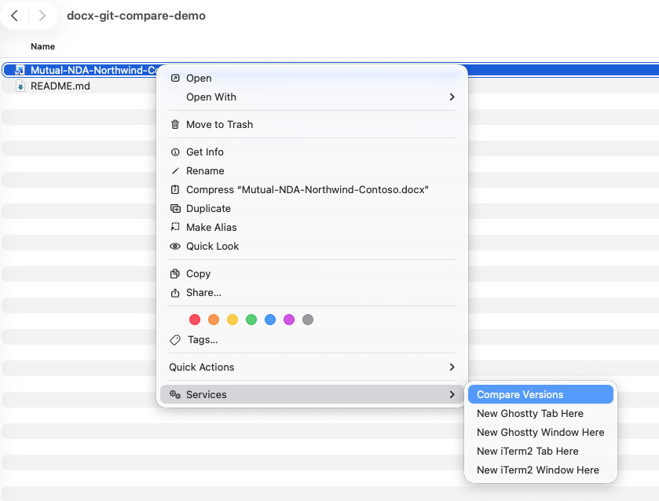
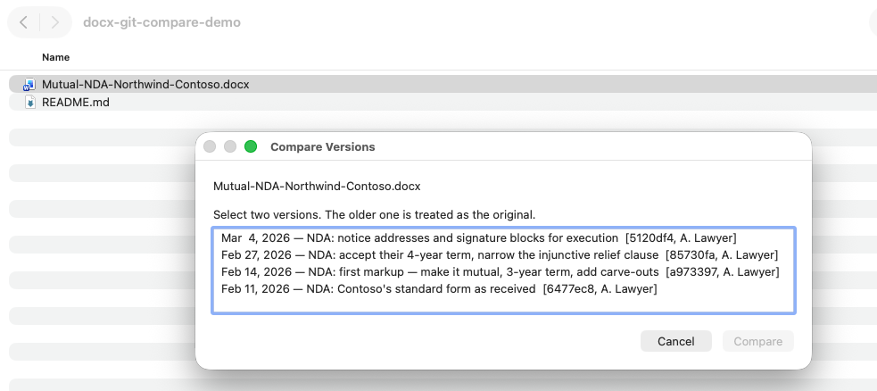
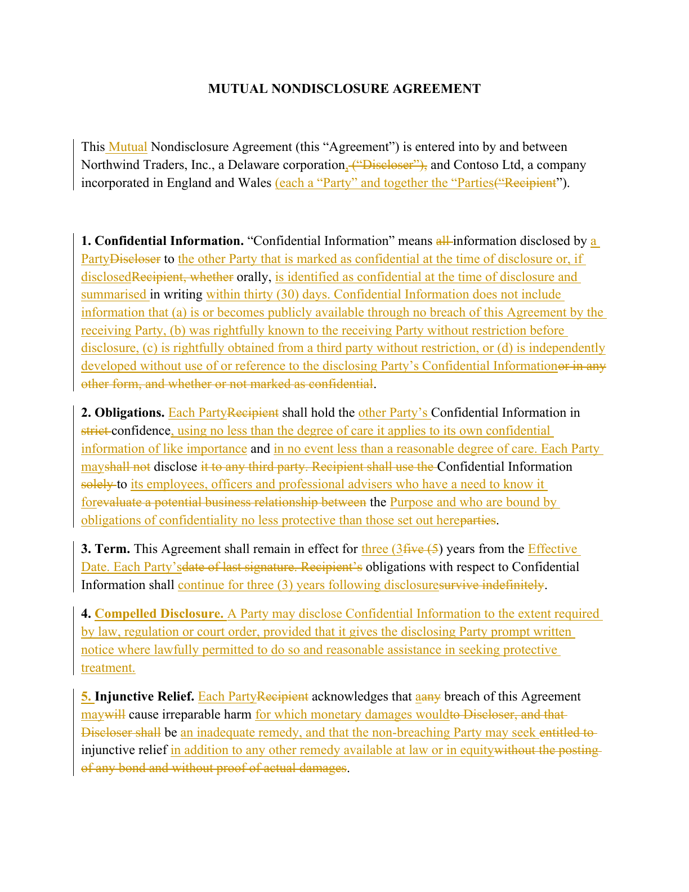

# docx-git-compare

Right-click a Word document in Finder, pick two versions out of its git history by their
commit message, and get Word's own redline between them.


If you keep contracts under version control, git already knows every version of every
document you have. What it cannot do is show you a Word user what changed, because a `.docx`
is a zip full of XML and `git diff` has nothing useful to say about it. This closes that gap:
the history comes from git, the redline comes from Word itself, so what you get back is a
real tracked-changes document you can accept, reject and comment on like any other.

Two tools, one of which uses the other:



Pick any two versions out of the document's own commit history:



And Word's own redline lands next to the original:



| | |
| --- | --- |
| [**gitcompare**](gitcompare/) | Redline a document against its own earlier versions in git. Finder right-click, or CLI. |
| [**wordcompare**](wordcompare/) | Drive Microsoft Word's Compare (Legal Blackline) between any two files, from the shell. |

## New to git?

Git keeps a permanent history of files in a folder. You save a version by "committing" it
with a one-line note about what changed — "first markup, made it mutual" — and git keeps
every version you ever committed, forever, alongside who committed it and when. Nothing is
overwritten and nothing needs a filename like `v3-FINAL-really.docx`.

What git will not do is tell a Word user what actually changed between two versions, because
`git diff` on a `.docx` says only "binary files differ". That is the gap this fills: the
history comes from git, the redline comes from Word.

## Using git, briefly

```bash
cd ~/Contracts                       # the folder your documents live in
git init                             # once, to start keeping history
git add .                            # pick up whatever changed
git commit -m "NDA: first markup"    # save a version, with a note
```

Repeat the last two lines whenever you want to keep a version. `git log` lists them.

## Does git need anything special for .docx?

No. It works out of the box.

A `.docx` is a zip archive of XML, so git treats it as binary and stores a complete copy of
each version rather than a compact record of what changed. For contracts that is a non-issue
— a 40-page agreement is well under 100 KB, so a hundred versions is a few megabytes.

## Requirements

macOS and Microsoft Word. Word does the actual comparison over AppleScript, so there is no
getting around either — this is not a headless tool and cannot run in CI. Tested on macOS 26
with Word 16.111.3. For a headless alternative see the comparison table in
[wordcompare/README.md](wordcompare/README.md).

## Install

```bash
git clone https://github.com/bencarver/docx-git-compare.git
cd docx-git-compare
./gitcompare/install-quick-action.sh
```

Then right-click any `.docx` in Finder and look under **Services** for **Compare Versions**.
The scripts run from wherever you cloned them, so keep the clone somewhere permanent.

The first run triggers two macOS permission prompts, for controlling System Events (which
shows the version picker) and Microsoft Word (which does the compare). The Word one arrives
late and quietly, and the compare sits blocked behind it, so if the first run appears to hang
or reports `AppleEvent timed out`, go find the prompt and click Allow. Once granted it stays
granted.

## Demo

`demo/make-demo-repo.sh` builds a throwaway repo containing a fabricated NDA between two
fictional companies, committed four times, so you can try the tool — or record it — without
touching a real document. See [demo/README.md](demo/README.md).

## Command line

The Finder right-click is the point of it, but everything works from the shell too:

```bash
gitcompare/gitcompare.sh Agreement.docx --list        # numbered version list
gitcompare/gitcompare.sh Agreement.docx --pick 1,3    # compare two of them
```

`--list` and `--pick` exist so the tool can be tested and scripted without the dialog.

## How it works

1. `git log --follow` builds the version list, so a document keeps its history through
   renames. Each entry is labelled with the commit date, subject and short SHA.
2. You pick two. The older is always treated as the original, so click order does not matter.
   If the working copy differs from HEAD it is offered as well, at the top of the list.
3. `git show` extracts both versions at the path each one had *at that commit*.
4. Word compares them, and the result lands next to the original as
   `<name>-COMPARE-<old>-vs-<new>.docx`.

## Notes

Only what is committed can be compared, and version granularity is commit granularity — a
week of edits squashed into one commit is one version here. Commit SHAs are baked into output
filenames, so rewriting history orphans the names of redlines generated before the rewrite;
regenerating is cheap.

Each tool's README documents the parts that were genuinely difficult to work out, in
particular the AppleScript incantation Word requires, the exact Automator workflow type
identifier a Finder service needs, and why the staging directory has to be a fixed path
inside Word's sandbox container.

## Licence

MIT. See [LICENSE](LICENSE).
